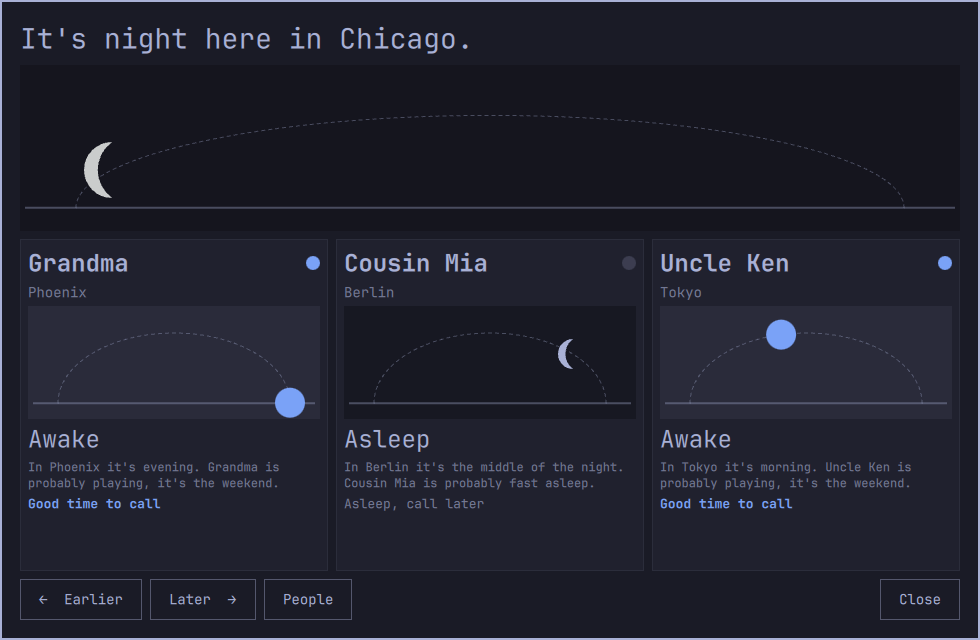
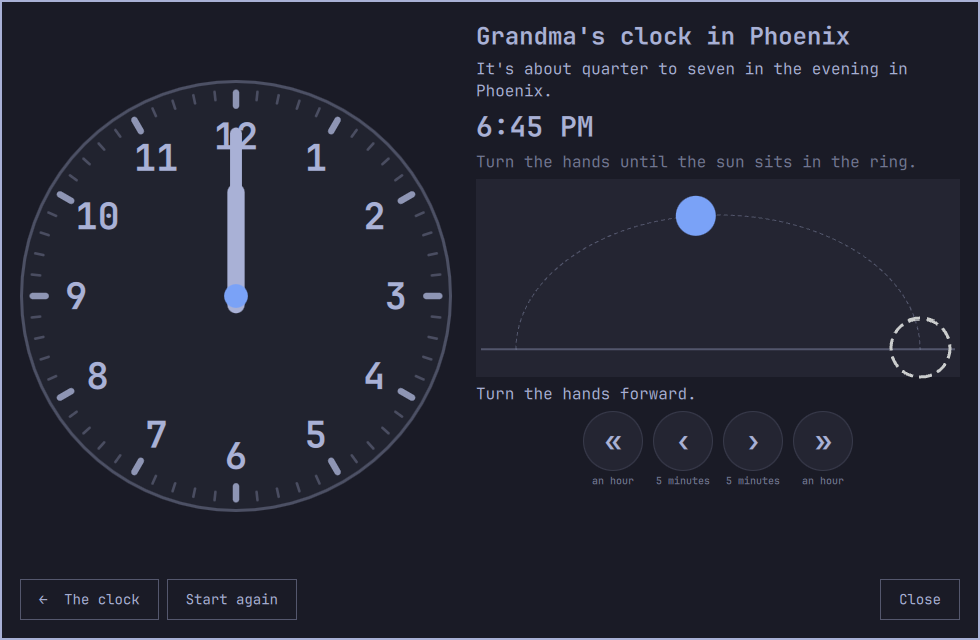
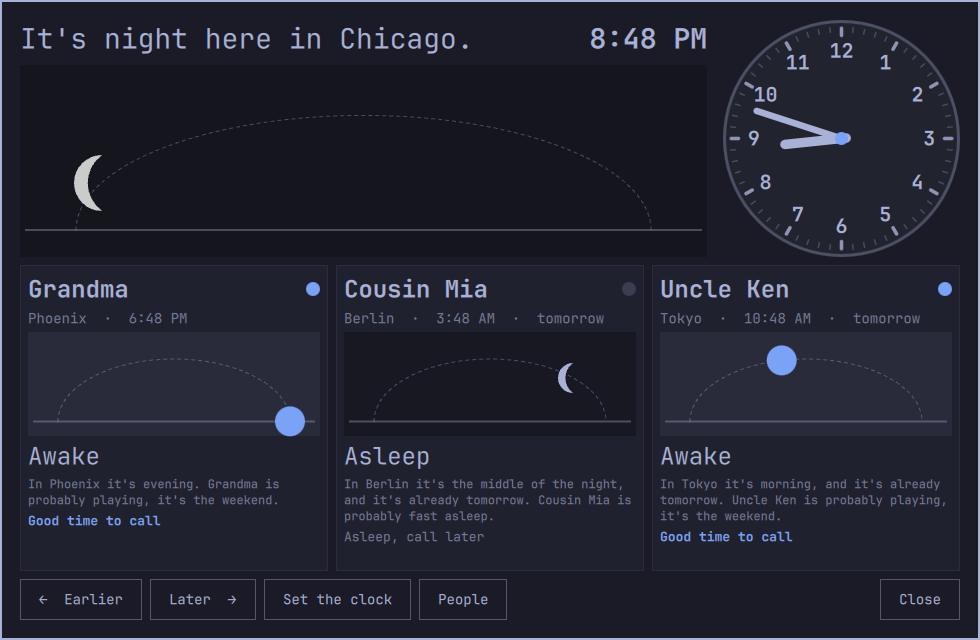
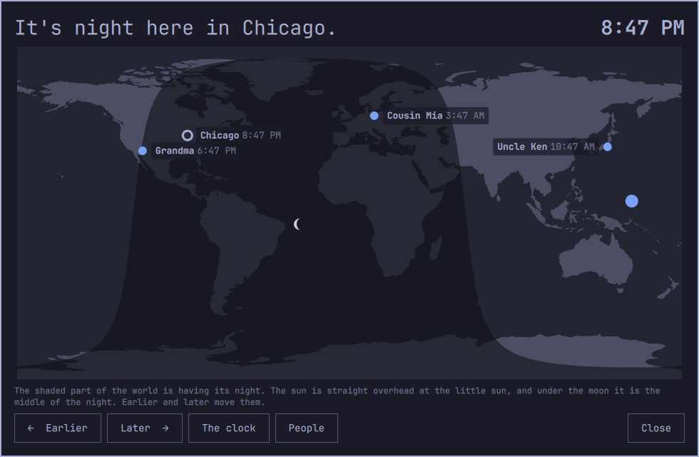
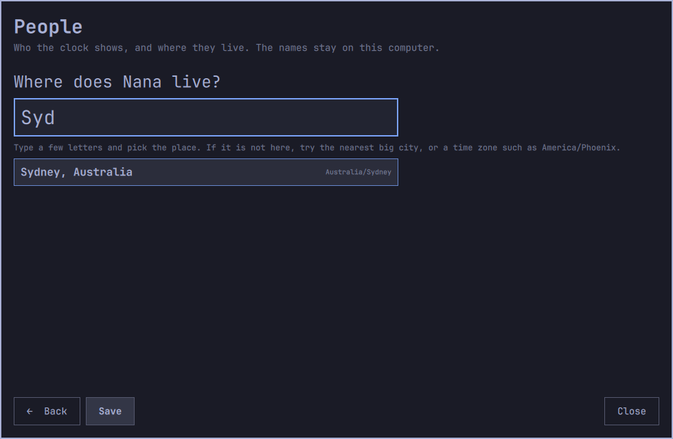

# Sun Clock

A clock for kids, as an Omarchy 4 (Quattro) shell plugin. It answers the
question a child asks about the people they love in other places: is Grandma
awake right now, and can I call her?

Time is abstract for a young child, so this clock does not lead with digits.
Each place gets a sky with the sun on its arc by day and the moon by night. A
sentence says what time of day it is there in words. Each person gets a card:
their own sky, whether they are awake, what they are probably doing, and
whether it is a good time to call. Two buttons move the sun forward and
back an hour at a time, so a child can watch it become bedtime in Tokyo.



From the second band an analog face sits beside the digits, showing the same
time, and a button opens a small game: set the hands to Grandma's time. The sun
under the face follows the hands, and the round is won when it sits in the
ring where Grandma's sun really is.



The plugin binds to Omarchy's theme tokens and ships no colours of its own.
The sun is the theme accent and the moon is the theme foreground, so it
re-tints when the theme changes, like the rest of the shell.

## The three faces

The age band is a parent setting. Each band adds to the one before.

| Band | Ages | What is on screen |
|---|---|---|
| explorer | 3 to 5 | home and up to three people; sun, moon and words only; no digits |
| tinkerer | 5 to 7 | adds the digital time, the analog face, "tomorrow" or "yesterday", and the set-the-clock game in quarter hours |
| navigator | 8 to 10 | adds the world map with the night side, "3 hours ahead", up to six people; the game works in five minutes |



## The map

On the Navigator band, The map swaps the clock for a map of the world with the
night side shaded. The shade is the real one for the shown instant, worked
out from the sun's declination and Greenwich solar noon, so it leans towards
one pole in December and the other in June, and it sweeps west as Earlier
and Later move the sun. A sun marks where the sun is straight overhead, a moon
where it is the middle of the night, a ring marks home and a dot each
person, with their time beside it. It is a flat map rather than a globe on
purpose: it hides no hemisphere, and the shade crossing a continent is the
whole lesson.



The land outlines are Natural Earth 1:110m, which is public domain, rounded
to a tenth of a degree in `data/land.json`. The places in `data/cities.json`
are Natural Earth's populated places, also public domain: every place over
300,000 people, every capital, plus a few carried over from the first list,
each with its time zone.

## Install

```bash
omarchy plugin add https://github.com/Ignibyte/omarchy-kids-clock.git
omarchy plugin enable ignibyte.kids-clock right
```

The plugin lands disabled so you can read the code first. Omarchy plugins run
unsandboxed inside `omarchy-shell` with your permissions. This one runs
`date` and `timedatectl` and reads its own `data/` files. It makes no
network requests and writes nothing outside `~/.config/omarchy/shell.json`,
where Omarchy keeps every plugin's settings.

## Adding people

Press People in the big clock. The People screen lists home and everyone the
clock shows, with where they live and their time. "Add someone" asks two
questions: what the child calls them, and where they live. Type a few
letters of the town or city and pick it from the matches; about 1,500
places are built in, and a name shared by several places, such as Portland,
is stored with its region so it comes back as itself. A place that is not
in the list can be given as a time zone, such as `America/Phoenix`. Each
person has a Remove button that asks once. The Home row picks the home city
when the computer's time zone is a region rather than your town, so the
sunrise is right.



Everything is saved to the plugin's own entry in `~/.config/omarchy/shell.json`
through the shell, the same way the built-in panels save their settings, so
the command line sees the same values.

## Settings

Omarchy 4.0.2 has no settings screen for plugins yet. Apart from the People
screen, the settings are edited on the command line or in the plugin's entry
in `~/.config/omarchy/shell.json`:

```bash
omarchy-shell shell setBarWidget ignibyte.kids-clock band '"tinkerer"'
omarchy-shell shell setBarWidget ignibyte.kids-clock people '"Grandma=Phoenix; Nana=Sydney"'
```

| Key | Default | Meaning |
|---|---|---|
| `band` | `explorer` | `explorer`, `tinkerer` or `navigator` |
| `people` | `Grandma=Phoenix; Cousin Mia=Berlin; Uncle Ken=Tokyo` | `Name=City` pairs separated by semicolons, which the People screen edits. Cities from the built-in list of about 1,500, `City, Region` when the name is shared, or any IANA zone such as `America/Phoenix`. An empty value shows nobody; a missing key shows these three examples |
| `homeCity` | blank | The city that matches the system time zone. Set it, or pick it on the People screen, when the system zone is a region rather than your town, so the sunrise is right |
| `wakeTime`, `schoolStart`, `schoolEnd`, `dinnerTime`, `bedTime` | `07:00`, `08:30`, `15:00`, `18:00`, `20:00` | The family routine. "Uncle Ken is probably at school" means the child's own routine moved to Tokyo, which is honest and personal rather than a guess about another country |
| `hourFormat` | `12` | `12` or `24`, for the bands that show digits |

Names never leave the machine. Nothing about a child is collected.

## In the bar

The chip shows the sun by day and the moon by night for home. Left click
opens the big clock. Right click puts the sun back to now after a scrub.

## The buttons

A row of buttons along the bottom of the card does everything, sized for
small hands and drawn with the shell's own button so they follow the theme.
Only the ones that mean something right now are shown.

| Button | Does |
|---|---|
| Earlier, Later | move the sun an hour earlier or later |
| Back to now | appears once the sun has moved, and puts it back |
| Set the clock | opens the set-the-clock game (tinkerer and navigator); clicking the analog face does the same |
| The map, The clock | swap between the map and the clock (navigator) |
| People | the People screen, where a parent adds and removes people |
| Close | closes the big clock; so does a click outside the card |

The keys do the same for anyone at a keyboard: Left and Right move the sun
(a quarter hour with Shift), 0 comes back to now, Enter opens the game, M is
the map, P is people, and Escape steps back and finally closes.

A view can be opened directly, which suits a keybinding:

```bash
omarchy-shell shell toggle ignibyte.kids-clock '{"view":"map"}'
omarchy-shell shell toggle ignibyte.kids-clock '{"view":"game"}'
omarchy-shell shell toggle ignibyte.kids-clock '{"view":"people"}'
```

## The set-the-clock game

One person at a time. Their time is frozen as the round starts and rounded
to the band's step, and the words say it the way school does: "It's about
quarter to three in the afternoon in Phoenix." The hands start at twelve in
the same half of the day, like a toy clock reset, so the child sets the hour
and then the minutes. The hour hand is geared to the minute hand, so half
past shows it halfway to the next numeral, which is the thing children find
hardest about a real clock.

The sky under the face belongs to that person, and its sun or moon follows
the hands. A dashed ring marks where the sun really is right now. When the
hands are right the sun sits in the ring, the ring fills, and the sentence
says what the person is probably doing. Twelve hours out is the one trap:
the hands read right, the sky shows the other half of the day, and the hint
says so.

Four big round buttons under the face turn the hands five minutes or an
hour either way. Start again puts them back to twelve, The clock leaves the
game, and once the round is won a button names the next person. On a
keyboard, Left and Right turn the hands five minutes (one with Shift), Up
and Down an hour, 0 resets them, Enter moves on and Escape leaves.

## How it works

`Model.js` is the whole logic, free of Qt so `node test/model-test.js` runs
it: the sunrise equation for the sun's place on the arc and for the night
side of the map, the routine mapping, the words, the hand angles, and the
game's rounds and hints. QML's JavaScript has no time zone tables, so
`Service.qml` asks `date` for each zone's offset through a Quickshell
process, one at a time. `Overlay.qml` draws the skies and the map with
QtQuick Shapes (the land as one SVG path built from the data file) and the
face from rotated rectangles, all bound to theme colours so they re-tint;
`BarWidget.qml` is the chip.

## Part of Omarchy Kids

A spoke of the community Kids Mode effort at
[markcuda/omarchy-kids-mode](https://github.com/markcuda/omarchy-kids-mode).
Started from Jason Fried's world clock plugin, which asks the grown-up
version of the same question.

MIT.
