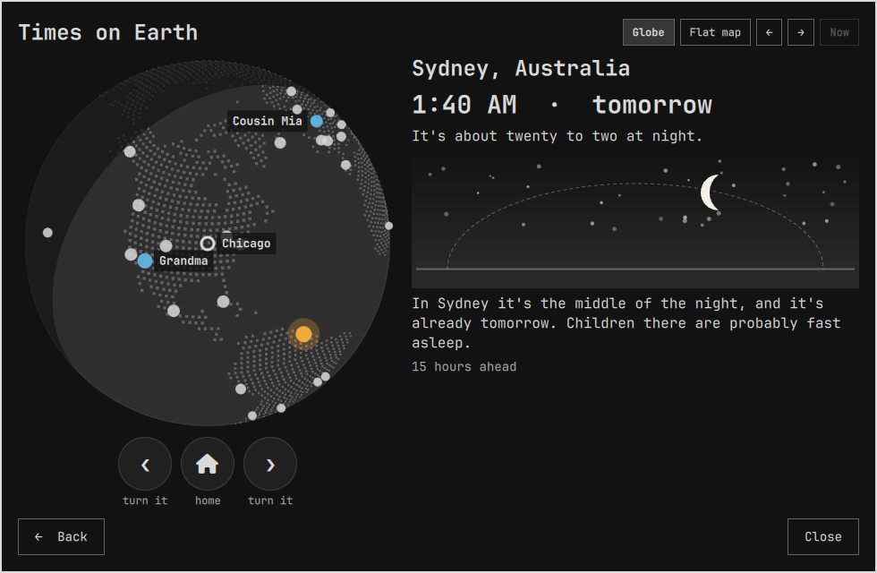
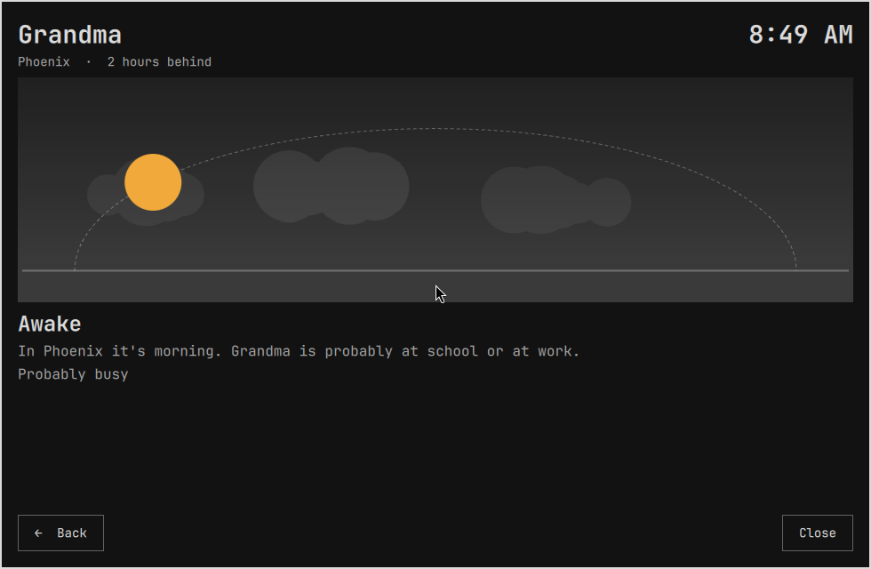
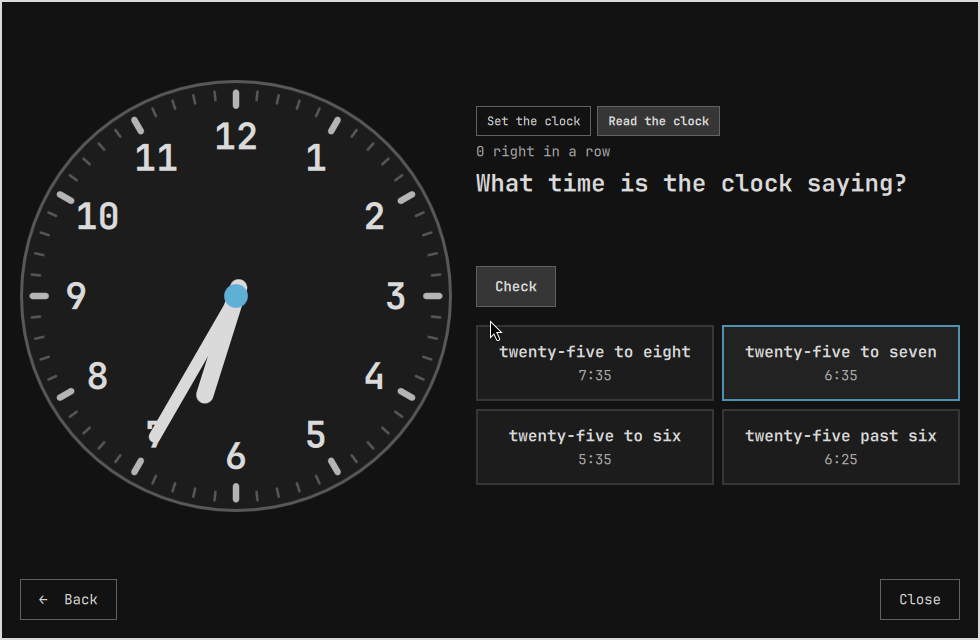

# Sun Clock

A clock for kids, as an Omarchy 4 (Quattro) shell plugin. It answers the
question a child asks about the people they love in other places: is Grandma
awake right now, and can I call her?

Time is abstract for a young child, so this clock does not lead with digits.
Each place gets a sky with the sun on its arc by day and the moon by night,
and the sky itself says which it is: a gradient that is darker overhead and
lighter towards the horizon, warming as the sun gets near it, with a few
clouds by day and a field of stars by night. A sentence says what time of day
it is there in words. Each person gets a card: their name, their time and
their own sky. Tapping the card opens their own page — whether they are awake,
what they are probably doing, whether it is a good time to call, and how many
hours ahead or behind they are. Two buttons move the sun forward and
back an hour at a time, so a child can watch it become bedtime in Tokyo.


Before anyone is added there is still a clock: home fills the card, its own
sky and, on the bands that have one, a full-size face. The arrows move
that sun, and the game needs nobody at all.

From the second band an analog face sits beside the digits, showing the same
time, and a button opens the clock game: set the hands to a time you are told,
or read the time the hands already show.


Every band gets Times on Earth: the world as a globe of dots, the night side
shaded, and a marker for home, for each person and for fifty well-known
places. Turn it with two buttons or a drag, tap a place, and the clock says
what time it is there. The Navigator band adds a flat map of the same world,
switched at the top of the screen.



The plugin binds to Omarchy's theme tokens: every surface, every border, every
piece of text and the whole of the sky's gradient is `Color.*` at some alpha,
so it re-tints when the theme changes, like the rest of the shell.

The sun and the moon are the one exception, on purpose. They are not chrome —
they are a picture of the sky, and on a theme with a blue accent a blue sun is
simply not a sun. So the sun is warm and the moon is bone-pale, and everything
around them still follows the theme.

Nothing here is an image file. The clouds are overlapping circles flattened
into one shape, the stars a fixed scatter, the land on the map and the globe a
path built from the data at draw time. It all scales to any size, re-tints
with the theme, and costs nothing to ship.

## The three faces

The age band is a parent setting. Each band adds to the one before.

| Band | Ages | What is on screen |
|---|---|---|
| explorer | 3 to 5 | home and up to three people; sun, moon and words only; no digits |
| tinkerer | 5 to 7 | adds the digital time, the analog face, "tomorrow" or "yesterday", up to four people, and the set-the-clock game in quarter hours |
| navigator | 8 to 10 | adds the flat map with the night side, "3 hours ahead", up to six people; the game works in five minutes |


## Times on Earth

One screen, two ways of looking: a globe on every band, and on the Navigator
band a flat map of the world as well. Both show the same thing — where the sun
is right now, who is in the night, and what time it is there — and the switch
between them is at the top of the screen, beside the arrows that move the sun.

### The globe

The globe shows the earth as a globe of dots with the night side
shaded, the sun where it is straight overhead, a ring for home, an accent dot
for each person, and a plain dot for each of fifty places most children have
heard of, from Honolulu round to Auckland. It starts turned to home. The two
round buttons under it turn it forty degrees at a time, dragging turns it
freely, and Find home brings it back. Tapping any dot names the place and says
the time there: the digits and "tomorrow" on the bands that read them, the
time in words ("It's about five to twelve in the morning"), the sky there, and
what a child there is probably doing, which is the family's own routine moved
to that place, the same honest guess the cards make. The arrows move the sun
here too, and the night sweeps round the globe as it goes.

### The flat map

On the Navigator band, Flat map lays the world out flat with the
night side shaded. It carries the same places as the globe — home, the people
and the fifty well-known cities — as dots to tap, and a line under the map
says what time it is at the one you tapped.

The top of the screen does not change when the view does: the same title, the
same switch, the same arrows and Now. Only the world below it is drawn
differently. The shade is the real one for the shown instant, worked
out from the sun's declination and Greenwich solar noon, so it leans towards
one pole in December and the other in June, and it sweeps west as the arrows
move the sun. A sun marks where the sun is straight overhead, a moon
where it is the middle of the night, a ring marks home and a dot each
person, with their time beside it. It is a flat map rather than a globe on
purpose: it hides no hemisphere, and the shade crossing a continent is the
whole lesson.


The land outlines are Natural Earth 1:110m Land, which is public domain,
rounded to a tenth of a degree in `data/land.json`. The places in
`data/cities.json` are from Natural Earth 1:10m Populated Places, also public
domain: every place over 300,000 people and every capital, about 1,460 in
all, each with a time zone checked against tzdata's own country table rather
than taken from Natural Earth, whose zone column is wrong for some twenty
places. `data/SOURCES.md` records the products, the filters and the
corrections.

## Install

```bash
omarchy plugin add https://github.com/Ignibyte/omarchy-kids-clock.git
omarchy plugin enable ignibyte.kids-clock right
```

The plugin lands disabled so you can read the code first. It needs nothing
beyond an Omarchy 4 install: `bash`, GNU `date` and `timedatectl` are all
there already, and `node` is only for the test.

### Removing

```bash
omarchy plugin disable ignibyte.kids-clock
omarchy plugin remove ignibyte.kids-clock
```

Disabling drops the plugin's entry from `~/.config/omarchy/shell.json`, and
with it every name and place entered on the People screen; note them first if
you want them back.

### What it touches

Omarchy plugins run unsandboxed inside `omarchy-shell` with your permissions.
This one runs `bash` (a one-line loop that asks `date` for each zone's
offset), `timedatectl` for the system zone, `omarchy-shell` from the bar
chip to open the big clock, and `pkexec /usr/bin/true` for the parent check
that guards the age band on the Me screen — nothing runs as root beyond that
`true`. It reads its own `data/` files and nothing else on disk. It makes no
network requests of its own. The only thing it writes is its own entry in
`~/.config/omarchy/shell.json`, through the shell's own save call, when
someone adds or removes a person, names home, or changes the band. A child can
reach the People and Me screens too; only the age band asks for a grown-up
first, and that is a check rather than a lock.

## Adding people

Press People in the big clock. The People screen lists home and everyone the
clock shows, with where they live and their time. "Add someone" asks two
questions: what the child calls them, and where they live. Type a few
letters of the town or city and pick it from the matches; about 1,460
places are built in, and a name shared by several places, such as Portland,
is stored with its region so it comes back as itself. A place that is not
in the list can be given as a time zone, such as `America/Phoenix`. Each
person has an Edit button, which asks the same two questions with the answers
already in them and puts them back in the same place on the clock rather than
at the end; tapping the row does the same. Remove asks once.

Home is not in this list. It has its own screen.

## Me

Me is where home is named. Home's clock is the computer's own and never moves
off the system time zone, so what home is called is free text: a town, a
street, "the house on the hill". Whatever is typed is what home is called.

Picking a real place from the list does one thing more — it puts home on the
map and the globe, and gives the sky the right sunrise for that latitude
instead of the one that belongs to the system zone. Saving an empty field
hands home back to the computer's own place.

The age band is set here too, since Me is the grown-up's screen. It shows the
three bands with their ages; tapping one asks for a parent's authentication
(through `pkexec`, the polkit prompt the Omarchy shell already answers) before
the band changes. This is a parent check, not a lock: it confirms a grown-up
is present, and does not make the setting root-owned — a child who can edit
`shell.json` can still change it. If the prompt cannot run, the same screen
shows the exact terminal command instead.


## A person's page

Tapping a card on the clock opens that person: their time and whether it is
today or tomorrow there, how many hours ahead or behind they are, their sky
at that hour, whether they are awake, what they are probably doing, and
whether it is a good time to ring. Left and Right step through the people
without going back to the clock first.



Everything is saved to the plugin's own entry in `~/.config/omarchy/shell.json`
through the shell, the same way the built-in panels save their settings, so
the command line sees the same values. A saved entry has to go out to the
shell and come back before the shell's own copy of the config says it, so the
clock believes what it just wrote until the shell agrees. Without that, a
second edit is built on a config that has not heard about the first, and adding
two people in a row loses one of them.

## Settings

Omarchy has no settings screen for plugins yet. Apart from the People
screen, and the age band (changed on the Me screen behind a parent check),
the settings are edited on the command line or in the plugin's entry
in `~/.config/omarchy/shell.json`:

```bash
omarchy-shell shell setBarWidget ignibyte.kids-clock band '"tinkerer"' '{}'
omarchy-shell shell setBarWidget ignibyte.kids-clock people '"Grandma=Phoenix; Nana=Sydney"' '{}'
```

| Key | Default | Meaning |
|---|---|---|
| `band` | `explorer` | `explorer`, `tinkerer` or `navigator` |
| `people` | `Grandma=Phoenix; Cousin Mia=Berlin; Uncle Ken=Tokyo` | `Name=City` pairs separated by semicolons, which the People screen edits. Cities from the built-in list of about 1,460, `City, Region` when the name is shared, or any IANA zone such as `America/Phoenix`; a zone tzdata does not know is reported as unknown rather than shown as UTC. Names up to 40 characters, places up to 64, at most 32 pairs kept. An empty value shows nobody; a missing key shows these three examples |
| `homeCity` | blank | What home is called, as free text, edited on the Me screen. Blank uses the city that matches the system time zone. A city from the built-in list also places home on the map and the globe and gives its sky the right sunrise; anything else is only the name. Home's clock follows the system time zone either way |
| `wakeTime`, `schoolStart`, `schoolEnd`, `dinnerTime`, `bedTime` | `07:00`, `08:30`, `15:00`, `18:00`, `20:00` | The family routine. "Uncle Ken is probably at school or at work" means the child's own routine moved to Tokyo, which is honest and personal rather than a guess about another country. The words fit a grandparent as well as a child, because most of the people on the clock are grown up |
| `hourFormat` | `12` | `12` or `24`, for the bands that show digits |
| `bestStreak` | none | The longest run of right answers in the game. The game writes it; there is no reason to set it by hand, and deleting it starts the best again |

Names never leave the machine. Nothing about a child is collected.

## In the bar

The chip shows the sun by day and the moon by night for home. Left click
opens the big clock. Right click puts the sun back to now after a scrub.

## The buttons

The row along the bottom of the card is **navigation and nothing else**: where
you can go from here, and the way back. `←  Back` is always the first thing in
it and always means one step out; `Close` is always on the right. A button in
that row never also changes what is on the screen.

What the screen you are on can *do* sits on that screen, next to the thing it
acts on. The two arrows that move the sun are under the clock they move. The
game's round switch, its score and its Check are at the top of the round. The globe and the
flat map are switched from the top of Times on Earth. Next and Save sit beside
the field they finish.

| Bottom row | Does |
|---|---|
| ←  Back | one step out: out of the game, Times on Earth, People or Me, and back a question inside the add flow |
| Play | opens the clock game (tinkerer and navigator); clicking the analog face does the same |
| Earth | Times on Earth |
| People | the People screen, where a parent adds and removes people |
| Me | the Me screen, where home is named |
| Close | closes the big clock; so does a click outside the card |

| On the screen | Does |
|---|---|
| a person's card | opens that person's page |
| Edit, Remove | on a person's row: change who they are and where they live, or take them off |
| ←, →, Now | move the sun an hour, and put it back. On the clock they sit under the face, which is the thing they move; at the top of Times on Earth otherwise. All three are always there, so the row never shifts under a hand |
| Globe, Flat map | the two ways of looking at Times on Earth (the flat map is navigator) |
| the house | turns the globe back to home; it sits between the two buttons that turn it |
| Set the clock, Read the clock | the two rounds of the game |
| the tick | at the end of the row that turns the hands, answers the round: right adds one to the run, wrong ends it. In Read the clock the tap on a time is the answer, so there is no tick |
| Start again, Another one | put the hands back where they began, and take a new round |
| Next, Save | finish the question the field is asking |
| Remove | on a person's row, asks once |

The keys do the same for anyone at a keyboard: Left and Right move the sun
(a quarter hour with Shift), 0 comes back to now, Enter opens the game, M is
the flat map, G Times on Earth, P people, and Escape steps back and finally closes. In
the game, Left and Right turn the hands a step (one minute with Shift), Up and
Down an hour, 0 puts them back, R swaps the two rounds, 1 to 4 pick an answer
in Read the clock, and Enter moves on once the round is won.

A view can be opened directly, which suits a keybinding:

```bash
omarchy-shell shell toggle ignibyte.kids-clock '{"view":"earth"}'
omarchy-shell shell toggle ignibyte.kids-clock '{"view":"map"}'
omarchy-shell shell toggle ignibyte.kids-clock '{"view":"globe"}'
omarchy-shell shell toggle ignibyte.kids-clock '{"view":"game"}'
omarchy-shell shell toggle ignibyte.kids-clock '{"view":"people"}'
omarchy-shell shell toggle ignibyte.kids-clock '{"view":"me"}'
```

## The clock game

Two rounds, and both are about the face alone. There is no sun in either, no
sky and no morning or afternoon: a dial says none of those things, and asking
a child to read a sun and a clock at once teaches neither.

**Set the clock** names a time — "Set the clock to quarter past three" — and
the child turns the hands until they say it. The hands start at twelve, like a
toy clock reset (at nine when the answer is twelve itself), so the hour goes
first and then the minutes. The hour hand is geared to the minute hand, so
half past shows it halfway to the next numeral, which is the thing children
find hardest about a real clock. Four round buttons turn the hands an hour or
a step either way. The prompt is not said twice: what the round wants is on
the screen once.

**Read the clock** does it the other way round: the hands are already set, and
four times are offered. The three wrong ones are the mistakes a child actually
makes — an hour out either way, "past" read as "to", and the two hands read
the wrong way round — so a guess that lands is a guess that was read.




### One press, one answer

In Set the clock, nothing says whether the hands are right until **Check** is
pressed — the fifth round button, at the end of the row that turns them. A
face that lit up the moment the hands landed made the game "turn the hands
until it lights up", which is not reading a clock. In Read the clock there is
no Check: four times to choose between is already one press, and the tap is
the answer.

Either way the round ends there. A right answer adds one to the run; a wrong
one shows what the time really was and the run goes back to nothing. The score
line says how many are right in a row and the best run so far, and the best is
kept with the settings, so it is still there tomorrow.

The time is random each round and never the same twice running. The band sets
how fine it is: quarter hours while "half past" and "quarter to" are still
new, five minutes once they are not. A button swaps the two rounds at any
time, and both work whether or not anyone has been added to the clock.

## How it works

`Model.js` is the whole logic, free of Qt so `node test/model-test.js` runs
it: the sunrise equation for the sun's place on the arc and for the night
side of the map, the routine mapping, the words, the hand angles, and the
game's rounds and hints. QML's JavaScript has no time zone tables, so
`Service.qml` asks `date` for the zones' offsets through one Quickshell
process per batch. `Overlay.qml` draws the skies, the map and the globe with
QtQuick Shapes (the map's land as one SVG path built from the data file, the
globe's land as one path of small squares from `data/globe.json`, about three
thousand equal-area samples of the same land, and the globe's night as
the near half of the terminator closed along the rim) and the face from
rotated rectangles, all bound to theme colours so they re-tint;
`BarWidget.qml` is the chip.

## What is next

[ROADMAP.md](ROADMAP.md) has what is likely to happen next and why in that
order, plus the questions still waiting on a decision.

## Part of Omarchy Kids

A spoke of the community Kids Mode effort at
[markcuda/omarchy-kids-mode](https://github.com/markcuda/omarchy-kids-mode),
built and maintained by Ignibyte; issues and pull requests at
[Ignibyte/omarchy-kids-clock](https://github.com/Ignibyte/omarchy-kids-clock).
The idea began with Jason Fried's world clock, an unpublished Omarchy plugin
he showed in August 2026, which asks the grown-up version of the same
question; nothing here is derived from it.

MIT.
